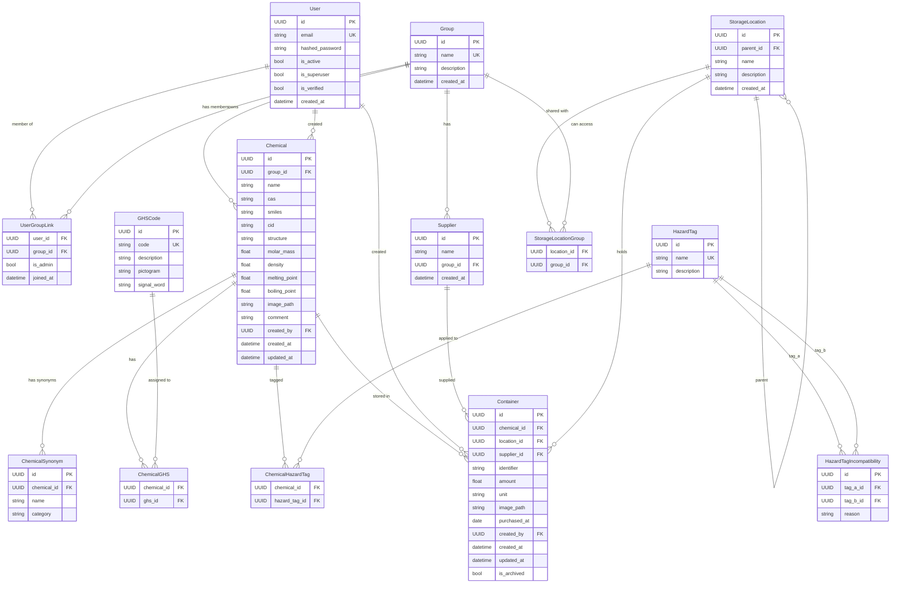

# ChAIMa Database Design

**Date:** 2026-04-10
**Status:** Approved
**Approach:** Adjacency List + Lean Normalization

## Overview

Chemical inventory management system built on FastAPI + SQLModel + fastapi-users. Multi-tenant via groups, with hierarchical storage locations and chemical hazard tracking.

## Tables (13 total)

### Auth & Groups

**User** (managed by fastapi-users)
- `id: UUID` PK
- `email: str` unique
- `hashed_password: str`
- `is_active: bool`
- `is_superuser: bool` — superadmin, sees everything
- `is_verified: bool`
- `created_at: datetime`

**Group**
- `id: UUID` PK
- `name: str` unique
- `description: str?`
- `created_at: datetime`

**UserGroupLink** — M:N User ↔ Group with admin flag
- `user_id: UUID` FK → User
- `group_id: UUID` FK → Group
- `is_admin: bool` — admin within this specific group
- `joined_at: datetime`
- Composite unique: (user_id, group_id)

### Chemicals

**Chemical** — core entity, scoped to one group
- `id: UUID` PK
- `group_id: UUID` FK → Group
- `name: str`
- `cas: str?` — CAS registry number
- `smiles: str?` — SMILES notation
- `cid: str?` — PubChem compound ID
- `structure: str?` — molecular formula
- `molar_mass: float?`
- `density: float?`
- `melting_point: float?`
- `boiling_point: float?`
- `image_path: str?` — file path on disc
- `comment: str?`
- `created_by: UUID` FK → User
- `created_at: datetime`
- `updated_at: datetime`

Note: The same real-world chemical (e.g. ethanol) can exist as separate records in different groups.

**ChemicalSynonym** — 1:N from Chemical, with optional category metadata
- `id: UUID` PK
- `chemical_id: UUID` FK → Chemical
- `name: str`
- `category: str?` — e.g. "IUPAC", "common", "trade name"

### GHS Codes (reference table)

**GHSCode** — pre-loaded standardized hazard statements
- `id: UUID` PK
- `code: str` unique — e.g. "H300", "H310"
- `description: str` — e.g. "Fatal if swallowed"
- `pictogram: str?` — e.g. "GHS06"
- `signal_word: str?` — "Danger" or "Warning"

**ChemicalGHS** — M:N Chemical ↔ GHSCode
- `chemical_id: UUID` FK → Chemical
- `ghs_id: UUID` FK → GHSCode
- Composite unique: (chemical_id, ghs_id)

### Hazard Tags & Incompatibility

**HazardTag** — somewhat free-form tags like "flammable", "oxidizing", "acid", "base"
- `id: UUID` PK
- `name: str` unique
- `description: str?`

**ChemicalHazardTag** — M:N Chemical ↔ HazardTag
- `chemical_id: UUID` FK → Chemical
- `hazard_tag_id: UUID` FK → HazardTag
- Composite unique: (chemical_id, hazard_tag_id)

**HazardTagIncompatibility** — pairs of tags that must not be stored together
- `id: UUID` PK
- `tag_a_id: UUID` FK → HazardTag
- `tag_b_id: UUID` FK → HazardTag
- `reason: str?` — optional explanation, e.g. "Exothermic neutralization reaction"
- Composite unique: (tag_a_id, tag_b_id)
- Convention: tag_a_id < tag_b_id to avoid duplicate reversed pairs

### Containers & Suppliers

**Container** — physical container of a chemical
- `id: UUID` PK
- `chemical_id: UUID` FK → Chemical
- `location_id: UUID` FK → StorageLocation
- `supplier_id: UUID?` FK → Supplier
- `identifier: str` — human-readable, unique per group (enforced at app layer via chemical.group_id)
- `amount: float`
- `unit: str` — pint-compatible string, e.g. "mL", "g", "kg"
- `image_path: str?` — file path on disc
- `purchased_at: date?`
- `created_by: UUID` FK → User
- `created_at: datetime`
- `updated_at: datetime`
- `is_archived: bool` default false — soft archive, hidden from default searches

No `group_id` — inherited from parent Chemical.

**Supplier** — lookup table, per group
- `id: UUID` PK
- `name: str`
- `group_id: UUID` FK → Group
- `created_at: datetime`

### Storage Locations

**StorageLocation** — adjacency list tree
- `id: UUID` PK
- `parent_id: UUID?` FK → StorageLocation (self-ref, null = root)
- `name: str`
- `description: str?`
- `created_at: datetime`

Hierarchy example: Room A → Shelf 1 → Bottom → Left

Full path is resolved via recursive CTE at query time. Tree depth is expected to be shallow (3-5 levels).

**StorageLocationGroup** — M:N StorageLocation ↔ Group
- `location_id: UUID` FK → StorageLocation
- `group_id: UUID` FK → Group
- Composite unique: (location_id, group_id)

## Key Design Decisions

1. **Adjacency list for storage hierarchy** — self-referencing FK with recursive CTE queries. Chosen over materialized path and closure table because tree depth is shallow and restructuring is rare.

2. **Images stored on disc, path in DB** — keeps DB lean, allows serving via reverse proxy/CDN, easier backup and migration.

3. **Units as pint-compatible strings** — stored as text (e.g. "mL"), converted at app layer using the pint library. No separate Unit table needed.

4. **Container soft-archive via `is_archived` flag** — containers are never deleted from DB, just hidden from default queries.

5. **Container identifier uniqueness** — enforced at app layer using the parent chemical's group_id, not a DB-level constraint (since group_id isn't on Container).

6. **GHS codes vs hazard tags** — two separate M:N relationships on Chemical. GHS codes are formal/standardized from a reference table. Hazard tags are free-form and drive the incompatibility rules.

7. **Incompatibility pair ordering** — convention of tag_a_id < tag_b_id prevents duplicate reversed pairs.

8. **Alembic for schema evolution** — all tables designed to be easily extensible via migrations.

## ER Diagram (Mermaid)

## Out of Scope

- Usage/withdrawal tracking (no extraction model)
- Notifications or audit logs
- API endpoint design (separate spec)
